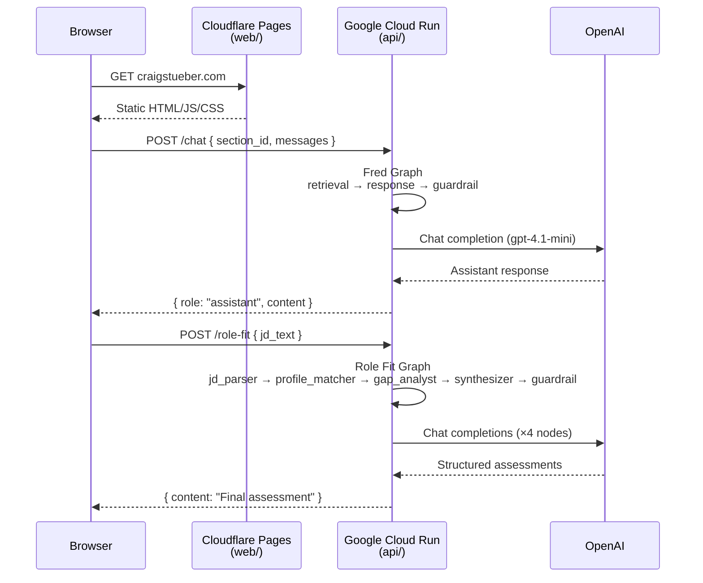
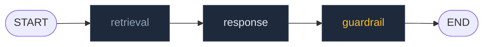
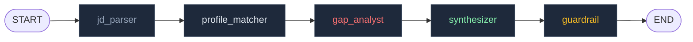

# Architecture — craig-portfolio

**craigstueber.com** is a professional portfolio site built as a live demonstration of applied AI architecture. It is not a static brochure — every section surfaces a context-aware AI agent backed by a real LangGraph pipeline running on Google Cloud Run. This document describes the system end-to-end for engineers who want to understand how it is structured, why it is structured that way, and where the significant design decisions were made.

---

## Table of Contents

1. [System Overview](#1-system-overview)
2. [Repository Structure](#2-repository-structure)
3. [Frontend — web/](#3-frontend--web)
4. [Backend — api/](#4-backend--api)
5. [Fred Graph](#5-fred-graph)
6. [Role Fit Graph](#6-role-fit-graph)
7. [Facts Architecture](#7-facts-architecture)
8. [State Schema](#8-state-schema)
9. [Observability](#9-observability)
10. [Environment Variables](#10-environment-variables)
11. [Key Architectural Decisions](#11-key-architectural-decisions)

---

## 1. System Overview

The site consists of three deployment targets. The frontend (`web/`) is a Next.js 16 static export deployed to Cloudflare Pages. The backend (`api/`) is a FastAPI + LangGraph application containerized with Docker and deployed to Google Cloud Run. A Cloudflare Workers edge proxy (`workers/`) is scaffolded but currently deferred — its role is described in [§11.6](#116-workers-deferred--cors-at-fastapi).

All API traffic flows directly from the browser to Cloud Run over HTTPS. CORS is enforced at the FastAPI layer.



### Stack at a Glance

| Layer         | Technology                                      |
| ------------- | ----------------------------------------------- |
| Frontend      | Next.js 16, TypeScript, CSS Modules, Geist Mono |
| Backend       | FastAPI, LangGraph, Python 3.12                 |
| LLM           | OpenAI `gpt-4.1-mini` for all agents            |
| Observability | LangSmith                                       |
| Hosting (web) | Cloudflare Pages                                |
| Hosting (api) | Google Cloud Run                                |

---

## 2. Repository Structure

The repository is a monorepo with clear separation between deployment targets.

```
craig-portfolio/
├── api/                        # FastAPI + LangGraph backend
│   ├── Dockerfile
│   ├── requirements.txt
│   └── app/
│       ├── main.py             # App factory, lifespan, CORS, router wiring
│       ├── config/
│       │   └── settings.py     # Pydantic Settings, feature flags, model names
│       ├── facts/
│       │   ├── loader.py       # Builds FACTS_CONTEXT singleton + SECTION_FOCUS_INSTRUCTIONS
│       │   ├── facts.personal.json
│       │   ├── facts.experience.json
│       │   ├── facts.education.json
│       │   ├── facts.projects.json
│       │   ├── facts.skills.json
│       │   ├── facts.research.json
│       │   └── facts.writings.json
│       ├── graphs/
│       │   ├── fred_graph.py   # Compiles and exposes fred_graph singleton
│       │   └── role_fit_graph.py
│       ├── nodes/
│       │   ├── retrieval.py    # Pass-through (Vectorize deferred)
│       │   ├── response.py     # Fred draft generation
│       │   ├── guardrail.py    # Shared exit guardrail
│       │   └── role_fit/
│       │       ├── jd_parser.py
│       │       ├── profile_matcher.py
│       │       ├── gap_analyst.py
│       │       └── synthesizer.py
│       ├── prompts/
│       │   ├── fred.py         # build_fred_system_prompt(section_id)
│       │   ├── guardrail.py
│       │   └── role_fit.py
│       ├── routes/
│       │   ├── chat.py         # POST /chat
│       │   ├── role_fit.py     # POST /role-fit
│       │   └── health.py       # GET /health
│       ├── services/
│       │   └── openai_client.py
│       └── state/
│           └── portfolio_state.py  # Shared LangGraph TypedDict
├── web/                        # Next.js 16 static export
│   ├── next.config.ts          # output: 'export', trailingSlash, unoptimized images
│   ├── package.json
│   ├── tsconfig.json
│   └── src/
│       ├── app/
│       │   ├── layout.tsx      # Root layout, Geist Mono font
│       │   ├── page.tsx        # Main portfolio page, historyMap ref, ChatModal orchestration
│       │   ├── globals.css
│       │   └── role-fit/
│       │       └── page.tsx    # Standalone /role-fit evaluation page
│       ├── components/
│       │   ├── chat/           # ChatModal, ChatThread, ChatMessage, ChatInput, TypingIndicator
│       │   ├── layout/         # Header, Footer, Nav
│       │   ├── role-fit/       # RoleFitForm, RoleFitResult
│       │   └── sections/       # Hero, Experience, Projects, Skills, Research, Writings, Education
│       ├── hooks/
│       │   └── useChat.ts      # Per-section message state, send, clear, error
│       ├── lib/
│       │   └── api.ts          # sendChatMessage, submitRoleFit — all API calls live here
│       └── types/
│           └── index.ts        # SectionId, Message, ChatRequest/Response, RoleFitRequest/Response
└── workers/                    # Cloudflare Workers edge proxy (deferred)
    └── src/
        └── index.ts
```

---

## 3. Frontend — web/

### Static Export

The frontend is a Next.js 16 App Router application configured with `output: 'export'`. This produces a fully static asset bundle deployed to Cloudflare Pages — no Node.js runtime, no server components, no ISR. All data fetching is client-side, called at interaction time (when the user opens a chat modal or submits a job description).

This is a deliberate choice described further in [§11.5](#115-static-export-for-cloudflare-pages). The short version: there is no rendering-time data that needs to be server-fetched, and a static export trades away flexibility the site doesn't need in exchange for zero cold-start latency and trivially simple deployments.

### Page Structure

The main page (`src/app/page.tsx`) is a long-scroll single-page portfolio with seven content sections rendered in sequence: Hero, Experience, Projects, Skills, Research, Writings, and Education. Section anchors support deep-linking from the navigation. Each section receives an `onOpenChat` callback that opens the shared `ChatModal` with the appropriate `sectionId`.

The `/role-fit` route is a standalone page for job description evaluation. It is completely independent of the main page and the Fred chat infrastructure.

### Chat Architecture

Chat state is managed in two layers. The `useChat` hook owns the live message array for a currently-open modal — it holds `messages`, `isLoading`, `error`, and the `send` callback. When the modal closes, history is surfaced upward via the `onSaveHistory` prop and stored in a `useRef`-backed `historyMap` keyed by `sectionId` in `page.tsx`. When the modal reopens for the same section, stored history is passed back as `initialMessages`, which `useChat` resets to.

This means per-section conversation history persists for the entire browser session without any server-side storage, but each section's thread is completely isolated from every other section. Opening the Experience chat cannot surface messages from the Skills chat.

All API communication is consolidated in `src/lib/api.ts`, which exports `sendChatMessage` and `submitRoleFit`. No component or hook calls `fetch` directly.

### Type System

`src/types/index.ts` defines the canonical types shared across the frontend:

- `SectionId` — a union of the seven section string literals plus `null` for the global context (Hero)
- `Message` — `{ role: "user" | "assistant", content: string }`
- `ChatRequest` and `ChatResponse` — typed to match the `/chat` endpoint contract exactly
- `RoleFitRequest` and `RoleFitResponse` — typed to match the `/role-fit` endpoint contract

---

## 4. Backend — api/

### Application Startup

`main.py` uses FastAPI's `lifespan` context manager to force compilation of both LangGraph graphs and validation of `FACTS_CONTEXT` at startup, before the application begins accepting requests. Any graph wiring error or empty facts file surfaces as a hard failure at deploy time rather than as a runtime error on the first user request.

```python
@asynccontextmanager
async def lifespan(app: FastAPI):
    from app.graphs.fred_graph import fred_graph
    from app.graphs.role_fit_graph import role_fit_graph
    from app.facts.loader import FACTS_CONTEXT

    assert fred_graph is not None
    assert role_fit_graph is not None
    assert FACTS_CONTEXT
    yield
```

### Routes

The API exposes three route groups:

- `GET /health` — liveness probe for Cloud Run
- `POST /chat` — accepts `{ section_id, messages }`, runs the Fred graph, returns `{ role, content }`
- `POST /role-fit` — accepts `{ jd_text }`, runs the Role Fit graph, returns `{ content }`

The `/chat` route validates `section_id` against a known set before invoking the graph. It converts the frontend's `[{ role, content }]` message array to LangChain `HumanMessage` / `AIMessage` objects before populating the initial graph state. Both user and assistant messages are passed so Fred has full conversation context within the section thread.

### Configuration

`app/config/settings.py` is a Pydantic `BaseSettings` class that reads from `.env`. Model names (`fred_model`, `role_fit_model`, `validation_model`) default to `gpt-4.1-mini` but can be overridden per environment. Three feature flags (`enable_fact_check`, `enable_drift_guard`, `enable_guardrail`) allow individual pipeline nodes to be bypassed for testing.

`enable_fact_check` and `enable_drift_guard` are legacy flags from an earlier graph design that included dedicated fact-checking and drift-guard nodes. Those nodes were consolidated into the single guardrail (see [§11.3](#113-simplified-fred-graph--single-guardrail)). The flags are retained so existing `.env` files don't break.

---

## 5. Fred Graph

Fred is the AI agent that responds to chat questions on each portfolio section. His graph is a three-node linear pipeline.



### retrieval

Currently a pass-through node — it returns an empty `retrieved_context` string and advances state to `response`. The node exists as the structural hook for Cloudflare Vectorize semantic retrieval, which is deferred pending traffic justification. When implemented, it will embed the user's query, retrieve the nearest fact chunks from Vectorize, and populate `retrieved_context` for the response node to incorporate.

### response

Generates Fred's draft response. It calls `build_fred_system_prompt(section_id)`, which injects the full `FACTS_CONTEXT` string and the section-specific focus instruction from `SECTION_FOCUS_INSTRUCTIONS`. If `retrieved_context` is non-empty (post-Vectorize), it is appended to the system prompt as additional context.

The response node uses `temperature=0.3` — low enough to stay grounded in facts, high enough to avoid robotic repetition across conversational turns.

### guardrail

A zero-temperature classification node that reads `draft_response` and checks for three failure modes: first-person voice drift (Fred must always speak _about_ Craig, never _as_ Craig), fabricated or inflated credentials, and off-topic content (e.g. general coding help). If the response passes, it is returned as `final_response`. If it fails, the guardrail substitutes the safe fallback: a concise message directing the visitor to contact Craig directly.

The guardrail runs on every response. The `enable_guardrail` flag in settings can disable it during local development, but it should always be enabled in production.

---

## 6. Role Fit Graph

The Role Fit graph evaluates an arbitrary job description against Craig's profile and produces a structured candidate assessment. It is a five-node linear pipeline with four distinct reasoning steps before the shared exit guardrail.



### jd_parser

Parses the raw job description text into a structured `dict` containing normalized requirement categories: required skills, nice-to-have skills, experience level, role type, and any domain-specific signals. Temperature is set to 0 — this is extraction, not generation. Output is stored in `jd_parsed` and consumed by all downstream nodes.

### profile_matcher

Maps Craig's profile against the parsed requirements. It has access to the full `FACTS_CONTEXT` and the `jd_parsed` dict. It produces a `fit_assessment` dict with match scores and evidence for each requirement category. The intent is honest mapping — not a sales pitch.

### gap_analyst

An adversarial pass over the `fit_assessment`. Its prompt instructs it to challenge any match it considers overly generous and to surface genuine gaps that the profile_matcher may have soft-pedaled. This is the node that preserves credibility — it prevents the assessment from reading as marketing copy. Output updates `fit_assessment` with the adversarial findings.

### synthesizer

Writes the final human-readable assessment from `jd_parsed` and the updated `fit_assessment`. This is the only node that produces prose rather than structured JSON. Temperature is 0.3. Output goes to `draft_response` for the guardrail.

### guardrail (shared)

The same guardrail node as in the Fred graph. In the Role Fit context it enforces that the assessment does not fabricate skills, inflate seniority claims, or misrepresent gaps that the gap analyst surfaced.

---

## 7. Facts Architecture

All seven facts files are authoritative ground truth. Nothing in the system invents or supplements what is in these files.

```
api/app/facts/
├── facts.personal.json    # Contact, location, links — surfaced only when directly asked
├── facts.experience.json  # Employment history, roles, responsibilities, outcomes
├── facts.education.json   # Degrees, institutions, dates, dissertation progress
├── facts.projects.json    # Notable projects with technical detail
├── facts.skills.json      # Skills mapped to evidence and proficiency
├── facts.research.json    # Doctoral research, methodology, publications
└── facts.writings.json    # Published articles, forthcoming book
```

`loader.py` is responsible for two things at module import time. First, it reads all seven JSON files and assembles them into a single `FACTS_CONTEXT` string formatted with section labels — this becomes the invariant knowledge base injected into every agent call. Second, it defines `SECTION_FOCUS_INSTRUCTIONS`, a dict mapping each `SectionId` to a focus instruction string that shapes _how_ Fred frames his responses, not _which_ facts he has access to.

The distinction matters: `section_id` is never used as a data access boundary. See [§11.1](#111-section_id-as-focus-instruction-not-data-boundary) for the full rationale.

Both `FACTS_CONTEXT` and `SECTION_FOCUS_INSTRUCTIONS` are module-level singletons initialized once when the Python module is first imported. The `lifespan` handler asserts that `FACTS_CONTEXT` is non-empty at startup, guaranteeing the singleton is populated before any request is served.

---

## 8. State Schema

Both graphs share a single `PortfolioState` TypedDict defined in `app/state/portfolio_state.py`:

```python
class PortfolioState(TypedDict):
    messages: Annotated[list[BaseMessage], add_messages]  # Full conversation history
    intent: str          # "fred" | "role_fit"
    section_id: str | None

    retrieved_context: str   # Populated by retrieval node (deferred)
    draft_response: str      # Written by response or synthesizer; read by guardrail
    final_response: str      # Written by guardrail; returned to caller

    jd_text: str | None      # Role Fit: raw job description input
    jd_parsed: dict | None   # Role Fit: structured JD from jd_parser
    fit_assessment: dict | None  # Role Fit: match + gap analysis
```

Fields unused by a given graph (e.g. `jd_text` in the Fred graph) are initialized to `None` or empty string in the route handler before the graph is invoked. Both routes initialize the full state dict so LangGraph never encounters missing keys mid-execution.

---

## 9. Observability

LangSmith tracing is enabled entirely through environment variables — no code-level instrumentation is required. When `LANGSMITH_TRACING=true` is set, LangChain automatically traces every LLM call, node execution, and graph invocation to the configured LangSmith project. This includes token counts, latency per node, full prompt and completion content, and graph-level metadata.

LangSmith traces are the primary debugging tool for prompt quality and guardrail behavior. Because the full system prompt (including `FACTS_CONTEXT`) is traced for every call, evaluating why a response was generated or why the guardrail fired is straightforward.

---

## 10. Environment Variables

### api/.env

| Variable             | Purpose                                               |
| -------------------- | ----------------------------------------------------- |
| `OPENAI_API_KEY`     | OpenAI API authentication                             |
| `LANGCHAIN_API_KEY`  | LangSmith authentication                              |
| `LANGSMITH_TRACING`  | Enables LangSmith trace export (`true`/`false`)       |
| `LANGSMITH_ENDPOINT` | LangSmith ingestion endpoint                          |
| `LANGSMITH_PROJECT`  | Project name for trace grouping                       |
| `ENABLE_FACT_CHECK`  | Feature flag — legacy, node removed                   |
| `ENABLE_DRIFT_GUARD` | Feature flag — legacy, node removed                   |
| `ENABLE_GUARDRAIL`   | Feature flag — set `false` to bypass guardrail in dev |

### web/.env.local

| Variable              | Purpose                                                |
| --------------------- | ------------------------------------------------------ |
| `NEXT_PUBLIC_API_URL` | Backend base URL (e.g. `https://api.craigstueber.com`) |

---

## 11. Key Architectural Decisions

### 11.1 `section_id` as Focus Instruction, Not Data Boundary

**What was decided:** Fred always receives the complete `FACTS_CONTEXT` regardless of which section opened the chat. The `section_id` only selects a focus instruction string that shapes tone and emphasis for that section.

**What the alternative was:** Filtering `FACTS_CONTEXT` to only include facts relevant to the active section — e.g. only injecting experience data when `section_id == "experience"`.

**Why this was rejected:** Filtering context at data access time introduces a class of failure where a reasonable user question gets a degraded response because the relevant facts were excluded. A visitor in the Skills section asking "what did you build at Accenture?" would trigger a context miss under a filtered design. Filtering also creates invisible scope boundaries that are hard to debug and hard to maintain as the facts files evolve. The FACTS_CONTEXT string is a few thousand characters — well within token budget for `gpt-4.1-mini`. There is no cost argument for filtering it. The focus instruction is expressive enough to shape Fred's responses without limiting his knowledge.

### 11.2 Session History Isolated per Section

**What was decided:** `page.tsx` maintains a `useRef`-backed `historyMap` keyed by `SectionId`. When a modal opens, it receives its section's stored history as `initialMessages`. When it closes, it saves its current messages back to the map. No history crosses section boundaries.

**What the alternative was:** A single global conversation history shared across all sections, or server-side session storage.

**Why this was decided:** Per-section isolation reflects the actual user experience — a visitor exploring the Experience section has a different conversational context from one exploring Research, and conflating those threads would produce confusing responses. Global history would also impose ordering requirements on visiting sections. Server-side session storage was not considered because there is no user authentication, no backend session infrastructure, and no value in persisting history beyond the browser tab. `useRef` is the right primitive because the history map must survive re-renders of `page.tsx` without triggering them — it does not need to be reactive state.

### 11.3 Simplified Fred Graph — Single Guardrail

**What was decided:** The Fred graph uses a single guardrail node at graph exit. Earlier iterations included dedicated `fact_check` and `drift_guard` nodes as separate pipeline stages.

**What the alternative was:** A three-step post-processing pipeline: fact_check (verifies factual accuracy against FACTS_CONTEXT) → drift_guard (detects first-person voice drift) → guardrail (catch-all).

**Why this was simplified:** The dedicated nodes solved real problems but created coordination overhead without proportional safety value. The guardrail prompt already handles first-person drift and fabricated credentials in a single classification pass at temperature=0. Running three separate LLM calls for post-processing tripled latency on every response and made the pipeline harder to observe in LangSmith. The consolidated guardrail is faster, simpler to debug, and covers the same failure modes. The feature flags `ENABLE_FACT_CHECK` and `ENABLE_DRIFT_GUARD` are retained in settings so existing `.env` files continue to work.

### 11.4 Role Fit as Multi-Agent Pipeline

**What was decided:** The Role Fit graph uses four distinct reasoning nodes before the guardrail — `jd_parser`, `profile_matcher`, `gap_analyst`, `synthesizer` — rather than a single prompt that handles the full evaluation.

**What the alternative was:** A single LLM call with a complex prompt instructing it to parse the JD, assess fit, identify gaps, and write the assessment in one pass.

**Why the multi-agent design earns its complexity:** The Role Fit task has meaningfully different cognitive requirements at each step. Parsing a JD into structured requirements is an extraction task (temperature=0, JSON output). Matching against a profile is a mapping task requiring access to `FACTS_CONTEXT`. The adversarial gap analysis requires a different stance — it is explicitly instructed to challenge the previous node's findings. Writing the final prose is a synthesis task. Combining these into one prompt creates a prompt that tries to do too many things, produces inconsistent output structure, and is hard to debug. The multi-step design allows each node to have an appropriate temperature, focused instructions, and produces structured intermediates (`jd_parsed`, `fit_assessment`) that are independently traceable in LangSmith.

### 11.5 Static Export for Cloudflare Pages

**What was decided:** The Next.js app is built with `output: 'export'`, producing a fully static bundle deployed to Cloudflare Pages. Server Components and server-side data fetching are not used.

**What the alternative was:** A standard Next.js deployment on Vercel or another Node.js runtime, enabling Server Components, RSC streaming, and server-side API routes.

**Why static export was chosen:** The portfolio does not have any rendering-time data requirements. Every content section is statically authored. All dynamic content is fetched client-side at interaction time — when a user opens a chat modal or submits a job description. A server runtime adds cost, cold-start latency, and operational complexity without providing any capability the site actually uses. Cloudflare Pages serves the static bundle from the CDN edge globally, so time-to-first-byte is minimal. `next/image` optimization is intentionally disabled (`unoptimized: true`) because static export cannot run the optimization server.

### 11.6 Workers Deferred — CORS at FastAPI

**What was decided:** The Cloudflare Workers edge proxy (`workers/`) is scaffolded but not deployed. CORS is handled directly in `main.py` via FastAPI's `CORSMiddleware`.

**What the alternative was:** All cross-origin requests routed through a Cloudflare Worker that adds CORS headers and proxies to Cloud Run, keeping the API origin hidden from the browser.

**Why this is deferred:** An edge proxy adds a deployment surface, a configuration layer, and an additional network hop for every API request. At current traffic levels, none of the benefits — origin hiding, edge-level rate limiting, regional routing — justify that overhead. If the site reaches a scale where Cloud Run regional latency matters or where bot traffic requires edge-level mitigation, the Workers scaffold is already in place and can be activated. Until then, CORS handled at the FastAPI layer is sufficient and simpler to operate.

### 11.7 Facts as JSON Singletons

**What was decided:** All seven facts files are loaded once at module import time into the `FACTS_CONTEXT` singleton. No request reads from disk.

**What the alternative was:** Reading and assembling facts on each request, or caching with an expiry to support hot-reload of facts content.

**Why this was chosen:** The facts represent fixed, verified biographical information. They do not change between requests. Loading them at startup is correct semantics — a hot-reload mechanism would imply the facts are volatile, which they are not. Loading once also means there is no per-request I/O against the facts files, and the startup assertion that `FACTS_CONTEXT` is non-empty provides a clear failure signal if something goes wrong with the facts directory during a deploy.

### 11.8 LangSmith Tracing via Environment Variables

**What was decided:** LangSmith observability is enabled entirely by setting `LANGSMITH_TRACING=true` and the related environment variables. No instrumentation code exists in the application.

**What the alternative was:** Explicit `LangSmith` client calls, custom callbacks, or a third-party tracing library wired into each node.

**Why this was chosen:** LangChain's native LangSmith integration is automatic when the environment variables are present — every `ChatOpenAI` call, every graph invocation, and every node execution is traced without any code changes. This means tracing can be toggled off in production if needed without a code deploy. It also means there is no tracing-specific code to maintain or audit. The zero-code approach is the right choice here: the goal is visibility into the pipeline, not a custom observability implementation.
